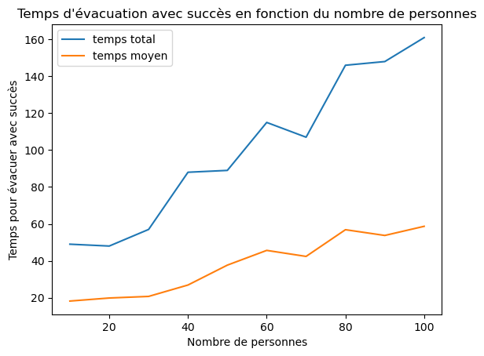
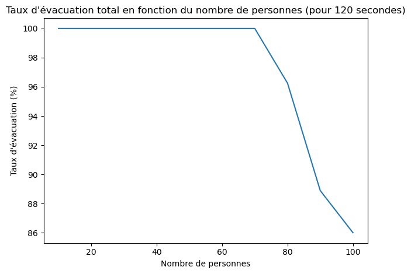
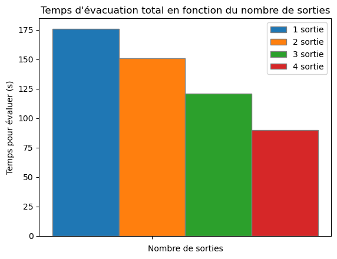
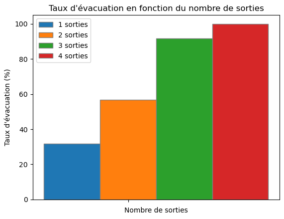
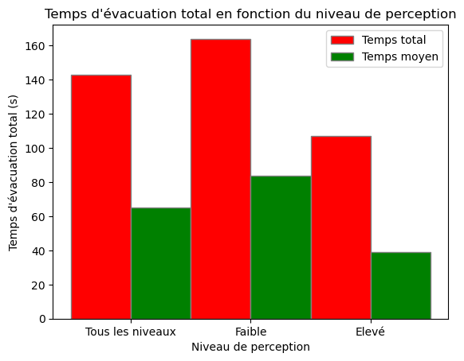
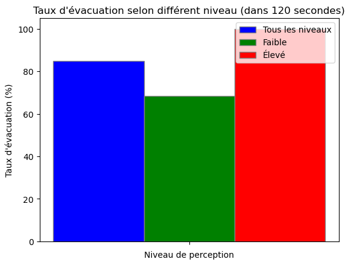

# Modélisation de l'évacuation en cas d'incendie

Notre projet vise à modéliser et simuler l'évacuation de personnes en cas d'urgence dans un espace, comme un incendie. Nous avons utilisé des méthodes de simulation informatique pour étudier les différents scénarios d'évacuation et évaluer l'efficacité d'évacuation. 

L’objectif est d’évacuer les personnes dans un espace rapidement et efficacement en cas d’incendie, ce qui est essentiel  pour minimiser les risques de blessures et de pertes humaines. Nos résultats obtenus indiquent que l'efficacité de l'évacuation dépend de plusieurs facteurs, notamment la vitesse de déplacement des personnes, la densité de population et la configuration des sorties.

# Description synthétique du projet
## Problématique
Quels facteurs influent sur la dynamique du mouvement de foule lors d'une évacuation en cas d'incendie ?

## Hypothèses
- Une densité élevée de population peut entraîner des ralentissements et des blocages, qui affectent la vitesse et la fluidité de l’évacuation.
- Les caractéristiques individuelles des personnes, telles que leur vitesse de déplacement et leur perception du danger, influencent le temps d'évacuation.

## Objectifs
Analyser les principaux facteurs qui influent sur la dynamique du mouvement de la foule :
- Évaluer l'impact des caractéristiques des personnes sur le temps d'évacuation. 
- Comparer les résultats d'évacuation en fonction de la densité de population, du choix de la sortie et des niveaux de perception, de la disposition de l'espace(dimensions, largeur de sorties)
- Proposer les stratégies d'évacuation pour minimiser le temps d'évacuation et maximiser la sécurité des personnes. 

## Critères d'évaluation
Évaluer l'efficacité dans le processus d'évacuation en comparant des temps total et des taux de réussite de l'évacuation dans différents scénarios, ainsi que de l'existence ou non d'un blocage au cours de la simulation.

# Présentation structurée des résultats
## Choix de modélisation et outils
Nous avons utilisé le langage de programmation Python pour modéliser des simulations. Nous avons implémenté un modèle d'évacuation où chaque personne est modélisée comme un agent qui se déplace dans un espace vers une sortie proche. Nous avons utilisé les bibliothèques NumPy et Matplotlib pour manipuler les données et visualiser les résultats.

## Démarches
Pour commencer, nous avons implémenté des fonctions pour générer aléatoirement les identifiants, les positions et les caractéristiques des sorties et des personnes ayant différents niveaux de perception du danger sous forme de tableaux numpy. 
Ensuite, en utilisant ces données, nous arrivons à implémenter plusieurs fonctions telles que : 
- sortiePlusProche : cherche la sortie la plus proche parmi plusieurs sorties
- direction : calcule la direction de personne pour le prochain pas(step)
- step : calcule le prochain step de la personne vers la sortie proche en fonction de leur vitesse
- new_position : met à jours la nouvelle position de la personne
- est_sortie : determine si la personne est sortie
- update_status : met à jours les informations de la personne une fois elle est sortie
- update_times : gère le temps de passage pour chaque sortie

Dans la fonction step_people, nous utilisons les fonctions listées ci-dessus pour faire une simulation d’évacuation complète. step_people retourne un tableau numpy de 3D qui représente les informations des personnes du début jusqu'à la fin de la simulation, ainsi que le temps total de la simulation et le temps de parcours moyen par chaque personne. Nous avons également implémenté la fonction évacuation qui calcule le nombre de personnes évacuées avec succès à la fin de la simulation. 

Après avoir obtenu des données de la simulation, nous souhaitons visualiser les résultats. Ainsi, nous avons mis en œuvre l’animation d'évacuation en fichier GIF et les trajectoires des personnes sous forme de graphe en utilisant la bibliothèque Matplotlib.

Enfin, nous avons réalisé des graphiques et des histogrammes à partir des données obtenues pour analyser les données obtenues, évaluer l'efficacité d'évacuation et discuter des facteurs influençant le temps d'évacuation et le taux de réussite. 

## Résultats et analyses
Nous allons évaluer le temps d'évacuation total, le temps moyen et le taux d'évacuation, qui sont des mesures importantes dans l'évaluation de l'efficacité des stratégies d'évacuation. 

Le temps d'évacuation total représente la durée totale nécessaire pour que l'ensemble des personnes évacuent l'espace, tandis que le temps moyen indique la moyenne du temps nécessaire à chaque personne pour atteindre une sortie depuis son point de départ. 

Le taux d'évacuation représente le pourcentage de personnes évacuées par rapport au nombre total de personnes dans l'espace.

### Densité de population
Situation : Nous avons un espace de dimensions 30 m x 30 m, équipé de 2 sorties pour l'évacuation. Nous simulons le déplacement de 10 jusqu'à 100 personnes à travers cet espace, avec une vitesse variant entre 0.3 et 0.8 m/s pour le niveau de perception faible, et entre 1.0 et 1.6 m/s pour le niveau élevé.

1. Temps d'évacuation total/moyen en fonction de densité de population

Ce graphe représente le temps d'évacuation total et le temps moyen en fonction de la densité de population. Initialement, lorsque le nombre de personnes est faible, l'écart entre les deux courbes est relativement petit. Cependant, au fur et à mesure que la densité de population augmente, la différence entre les deux temps augmente également. Cela indique que l'augmentation de la densité de population a un impact sur la différence entre le temps d'évacuation total et le temps moyen.

Cette différence croissante peut s'expliquer par le blocage des sorties. Avec l'augmentation de la densité, les sorties risquent d'être bloquées, de plus en plus de personnes attendent l'évacuation devant les sorties, ce qui prolongera le temps d'évacuation total. D'ailleurs, les temps de parcours moyens élevés peuvent être dû à des obstacles sur le chemin de sortie, à des défaillances des infrastructures ou à d'autres facteurs qui empêchent le mouvement des personnes.

2. Taux d'évacuation en fonction de la densité de personnes (pour 120 secondes)¶

Dans ce graphique, nous remarquons jusqu'à 60 personnes, le taux d'évacuation est optimal, avec toutes les personnes évacuées dans les 120 secondes. Cependant, au-delà de 60 personnes, le taux d'évacuation diminue fortement. Avec 70 personnes, le taux d'évacuation est de 97%, tandis qu'avec 100 personnes, il chute à 75%.

Cette simulation met en évidence l'impact de la densité de population sur l'efficacité de l'évacuation. Plus la densité de personnes dans l'espace est élevée, plus il est difficile de garantir une évacuation rapide et efficace. Cela montre l'importance de prendre en compte la densité de population lors de la conception des espaces, afin de garantir des conditions optimales d'évacuation. 

### Nombre de sorties 
Situation : un espace de 30x30 avec deux sorties disponibles. Nous avons pris en compte tous les niveaux de perception du danger avec deux plages de vitesses : de 0.3 à 0.8 m/s pour la faible et de 1.0 à 1.6 m/s pour l'élevée.

1. Temps d'évacuation en fonction du nombre de sortie

Cet histogramme illustre comment le nombre de sorties affecte le temps d'évacuation. Nous pouvons observer qu’avec une seule sortie, les temps d’évacuation sont assez longs car les blocages sont inévitables. En revanche, lorsqu’il y a quatre sorties, le temps d’évacuation est considérablement réduit, ce qui permet une évacuation plus rapide. 

2. Taux d'évacuation en fonction du nombre de sortie

Dans cet histogramme, nous avons 4 valeurs distinctes correspondant à 1, 2, 3 et 4 sorties disponibles. Nous avons observé que le temps nécessaire pour évacuer la population diminue à mesure que le nombre de sorties augmente. Plus précisément, pour une seule sortie, le taux d'évacuation est initialement plus faible, mais il s'améliore considérablement avec l'ajout de sorties supplémentaires. Cela indique que la disponibilité de plusieurs sorties accélère le processus d'évacuation. 

Ces 2 résultats montrent l’importance de disposer d’un nombre adéquat de sorties lors de la conception et de l’aménagement des espaces et La répartition stratégique des sorties peut réduire le risque de congestion. 

### Niveau de perception du danger
Situation : Nous avons un espace de dimensions 30 mètres x 30 mètres, équipé de 2 sorties pour l'évacuation. Nous simulons le déplacement de 60 personnes à travers cet espace, avec une vitesse variant entre 0.3 et 0.7 m/s pour le niveau de perception faible, et entre 1.0 et 1.8 m/s pour le niveau élevé. 

1. Temps d'évacuation total en fonction du niveau de perception du danger

Cet histogramme divise les données en trois catégories selon le niveau de perception du danger : tous les niveaux, niveau faible (vitesse entre 0.3 et 0.8 m/s) et niveau élevé (vitesse entre 1.0 et 1.6 m/s). Les barres représentent le temps d'évacuation total et moyen pour chaque catégorie. 
Nous pouvons remarquer que pour les niveaux de perception faible, les temps d'évacuation total et moyen sont plus élevés que les autres, les personnes prennent donc plus de temps à évacuer par rapport à celles ayant un niveau élevé. Pour les niveaux de perception élevés, le temps d'évacuation total est le plus court, ce qui indique une évacuation plus rapide et efficace pour ce groupe. 

2. Taux d'évacuation en fonction du niveau de perception¶

Cet histogramme représentant le taux d'évacuation en fonction du niveau de perception du danger, nous avons 3 catégories distinctes : tous les niveaux, niveau faible et niveau élevé. Pour le niveau faible, la vitesse de déplacement varie entre 0.3 et 0.7 m/s, tandis que pour le niveau élevé, la vitesse est entre 1.1 et 1.6 m/s. Sur un temps de simulation de 120 secondes, nous avons constaté que les personnes ayant un niveau de perception élevé étaient évacuées à 100%. Cependant, le taux d'évacuation réduit à environ 70% pour celles ayant un niveau de perception faible. 

En réalité, ces différents niveaux de perception font référence à des personnes d’âges ou de conditions physiques différentes. Les personnes ayant un niveau de perception élevé comme les jeunes adultes peuvent réagir plus rapidement et prendre des décisions plus efficaces en cas d'urgence. En revanche, ceux avec un niveau de perception faible peuvent être plus lents à réagir, entraînant des retards dans l'évacuation. Ainsi, pendant le processus d’évacuation, nous pouvons fournir un soutien prioritaire aux enfants, aux personnes âgées ou aux personnes handicapées afin de garantir leur sécurité.

### Simulation des scénarios
#### Scénario 1 : Évacuation d’une salle de classe
- Dimensions de la salle : 8m x 8m
- Nombre de personnes : 30
- Dispositions de sorties : 1 puis 2 portes ouvertes, une seule personne peut se passer en même temps
- Population étudiée : étudiants et enseignants, avec une vitesse entre 0.3 et 1.3 m/s (pour simuler l’évitement d'obstacles)

Résultats : 

Avec une seule sortie
- A t =  89 s, tout le monde est évacué avec succès

Avec 2 sorties
- A t =  71 s, tout le monde est évacué avec succès

#### Scénario 2 : Évacuation dans un couloir
- Dimensions de la salle : 30m x 2m
- Nombre de personnes : 50
- Dispositions de sorties : 2 portes ouvertes à 2 côté de couloir, une seule personne peut se passer en même temps
- Population étudiée : étudiants et enseignants, avec une vitesse entre 0.3 et 0.7 m/s (car le couloir est étroit)

Résultats : 
- A t =  73 s, tout le monde est évacué avec succès
- temps total = 73s
- temps moyen = 29.35s

#### Scénario 3 : Évacuation d’une grande salle
- Dimensions de la salle : 25m x 15m
- Nombre de personnes : 200
- Dispositions de sorties : 4 portes ouvertes à 4 côté de la salle, 2 personnes peut se passer en même temps
- Population étudiée : adultes, avec une vitesse entre 0.3 et 0.7 m/s

Résultats :
- A t =  112 s, tout le monde est évacué avec succès
- temps total = 112 s
- temps moyen = 40.56 s

En résumé, le temps d’évacuation total est un indicateur important pour mesurer l’efficacité globale de l’évacuation. La réduction du temps total indique une meilleure capacité des personnes à réagir pendant l'évacuation. Elle peut être affectée par des facteurs externes tels que la densité de population et la configuration des sorties. 

D'ailleurs, en raison des différences de vitesse de déplacement et de perception du danger entre les personnes, le temps d'évacuation moyen sera différent pour chaque personne. Cela peut être affecté par des différences individuelles et des comportements imprévisibles des personnes.

Cependant, le taux de réussite de l'évacuation n'est peut-être pas le meilleur indicateur pour définir une évacuation réussie. Par exemple, il peut ne pas tenir compte des personnes qui sont déjà en danger pendant l'évacuation.

# Conclusion et ouverture
En conclusion, l'utilisation de L'outil informatique pour créer des simulations d'évacuation détaillées nous a permis d'analyser et d'évaluer l'impact de différents facteurs sur le temps d'évacuation. Nos résultats démontrent que l'augmentation de vitesse de déplacement des personnes et l'amélioration des dispositifs des sorties contribue à réduire le temps total. Ainsi, une stratégie efficace basée sur nos résultats est d'installer des signalisations de sortie de secours clairs pour permettre aux gens de les trouver rapidement. De plus, les obstacles sur les voies d'évacuation doivent être dégagés régulièrement pour des raisons de sécurité et d'efficacité, ainsi que les exercices d'évacuation pourront être organisés régulièrement afin de renforcer la capacité de traiter les cas d'urgence. Des sorties supplémentaires et bien situées dans l'espace peuvent également raccourcir le temps d'évacuation.

Néanmoins, il nous reste encore des aspects intéressants qui peuvent rendre la simulation plus précise. Par exemple, nous pouvons intégrer les comportements d'évitement d'obstacles et de suivi du groupe, les interactions entre les individus ainsi que les variations de vitesse et d'angle de mouvement, ces aspects permettent le mouvement de la foule plus fluide et donnent une simulation plus précise et réaliste. En outre, l'intégration de facteurs environnementaux tels que la réduction de la visibilité due à la fumée rendrait l'évaluation plus rigoureuse. 

